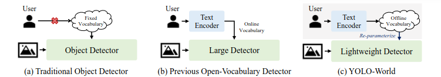
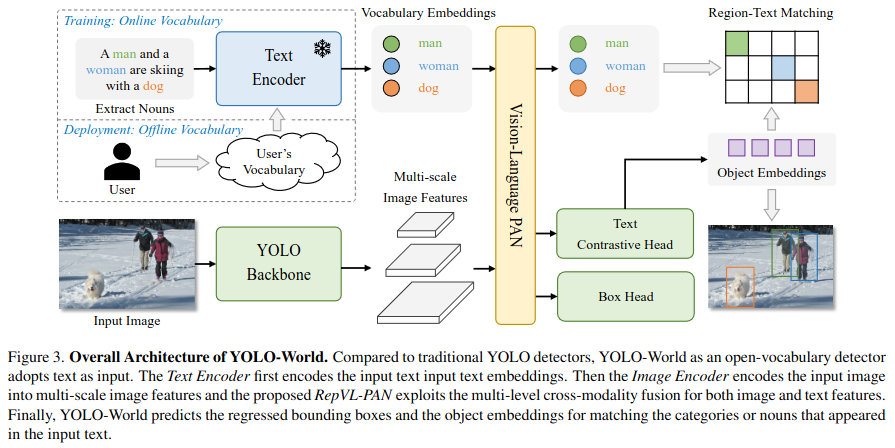
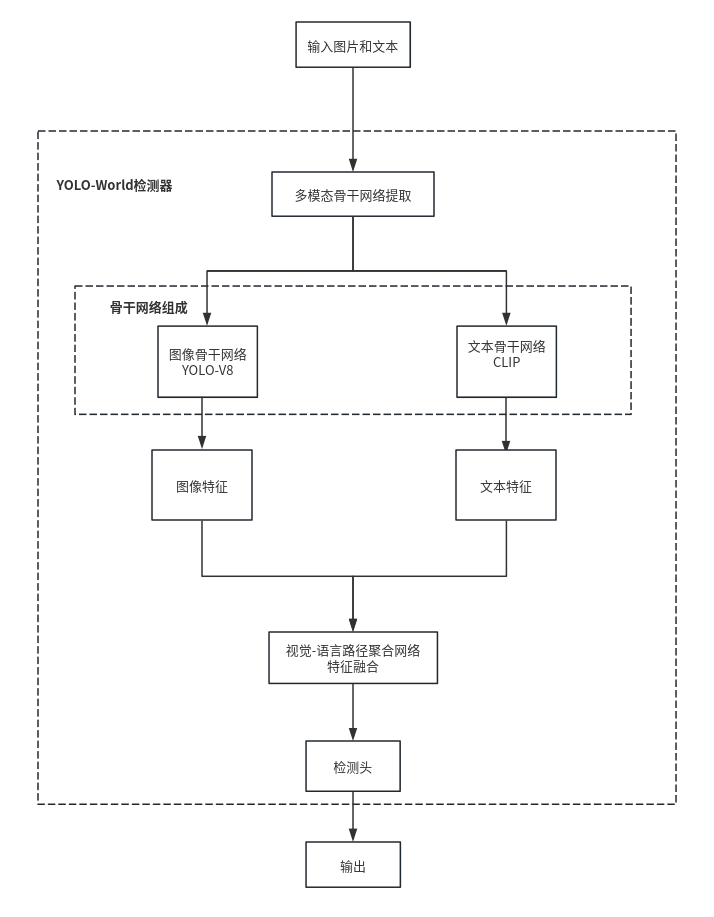
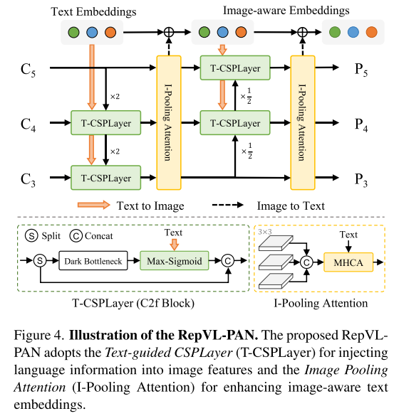
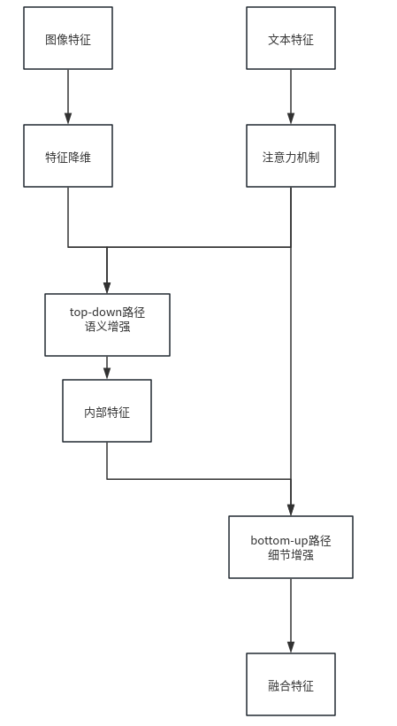
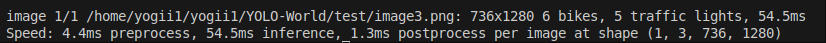

# YOLO-World: Real-Time Open-Vocabulary Object Detection

[原文链接https://arxiv.org/abs/2401.17270](https://arxiv.org/abs/2401.17270)

[Github链接https://github.com/AILab-CVC/YOLO-World/tree/master](https://github.com/AILab-CVC/YOLO-World/tree/master)

## 论文总结

### 问题

 传统yolo系列目标检测器虽然高效，但受到“固定词汇表”（fixed vocabulary）的限制，只能检测预定义类别，如coco数据集中的80类。这种依赖限制了检测器在开放场景中的适用性，无法识别未知新的物体。

 此前的开放词汇检测方法（GLIP、Grounding DINO）虽然解决了固定词汇表无法识别新物体的问题，但依赖大型模型网络和在线文本编码，导致较大的计算负担，难以在边缘设备上部署，难以满足实际应用，这些方法需要同时将图像和文本作为输入进行编码和预测，在实际应用中难以满足实时性要求。

 此前研究聚焦于预训练大型检测器，但对于如何预训练小型检测器来使其具备开放识别能力仍存在空白。论文针对这些问题提出了一种高效、实时且易于部署的开放词汇目标检测器——yolo world。



### 创新点

- **提出了轻量化的开放词汇检测框架** ：将yolo架构扩展为开放词汇检测器，yolo架构引入视觉-语言模型（Vision-Language Modeling）通过视觉-语言预训练实现高效零成本检测，在LVIS数据集上达到约35.4AP-52FPS，较DetCLIP、GLIP等有约20倍的速度提升。
- **可重参数化的视觉-语言路径聚合网络RepVL-PAN**：提出了一种新的特征融合网络，用于连接文本特征和图像特征，以实现更好的视觉语义表示。
- **提示后检测范式（Prompt-then-Detect）**: 提出了一种新的推理模式，用户可根据需求定义提示Prompts，生成离线词汇表（offline vocabulary），重参数化为模型权重后部署，避开在线编码开销，提升推理效率。
- **区域-文本对比预训练（Region-Text Constrative Pre-training）**：将检测数据、定位数据（Grounding data）和图像-文本对（Image-text data）统一为区域-文本对（region-text pairs）进行大规模预训练


## 论文方法

### YOLO-World架构

yolo-world模型能够根据输入的文本提示（prompts）检测图片中对应的对象，即使这些对象在训练时并未被标注。

输入图像 $I$ 和文本$T$ ，输出预测框{$B_K$} 和对应文字嵌入{$e_K$}。

- **训练：在线词汇**：

  yolo-world以文本作为输入，文本编码器对输入文本进行编码，模型训练时输入是含上下文的句子，模型从文本中提取名词，输入到文本编码器（text encoder）构成在线词汇表。转化为具有语义信息的向量表示，即词汇嵌入（Vocabulary Embeddings）。

- **部署：离线词汇**：

  用户可根据需求定义一个用户词汇表（User’s Vocabulary），这些词汇会被一次性编码成词汇嵌入 (Vocabulary Embeddings)，作为离线词汇储存，从而在推理时无需每次都运行文本编码器，提高效率。

**文本编码器**将名词转换为高维的词汇嵌入，代表了词汇的语义信息。



**输入流程：** yolo-world用图像和文本作为输入，系统同时接收待检测的图像数据和用户定义的文本提示。

- **多模态骨干网络提取：** 将图像和文本的特征提取称为多模态骨干网络（ MultiModalYOLOBackbone），内部包含两个并行的子模块：
- **图像骨干：**基于yolo-v8的图像骨干网络，用Darknet架构作为图像编码器，从输入图像中提取多尺度视觉特征（Multi-scale Image Features），特征包含了图像的视觉信息。


  - **文本骨干：**采用预训练的CLIP Transformer作为文本编码器，将输入的文本提示编码为文本嵌入。

    两个子模块独立运行，输出特征供后续融合。


- **视觉-语言路径聚合网络：**

  **输入:** YOLO主干网络的多尺度图像特征和文本编码器生成的词汇嵌入。

  用于连接文本特征和图像特征。通过跨模态融合机制，将文本的语义信息融入到图像特征中，从而增强模型的视觉-语义表示能力。

  基于论文提出的可重参数化视觉语言路径聚合网络（RepVLPAN），推理过程中移除了文本编码器，将文本嵌入重新参数化为RepVL-PAN的权重。

  遵循自顶向下，自底向上的路径，接收来自骨干网络的图像特征和文本嵌入。在特征层级实现视觉和语言的深度交互和融合，让模型理解图像区域与文本描述的关系。

  - 利用 Text-guided CSPLayer (T-CSPLayer) 将语言信息注入图像特征。
  - 利用 Image-Pooling Attention 利用图像信息增强文本嵌入 。

- **检测头：**

   将多模态融合特征转换为最终检测结果，对比学习逻辑代替了分类逻辑，输出对象嵌入向量。

  - BBOX Head：回归预测物体边界框，预测图像中物体的精确位置和大小。

  - Text Contrastive Head：生成对象嵌入向量（object embedding），用于与文本编码器生成的文本嵌入进行匹配，从而判断物体类别。



### 视觉-语言路径聚合网络RepVL-PAN

作为连接视觉图像特征和文本特征的核心组件，旨在增强图像和文本的表示，以提升开放词汇目标检测能力。



**输入：**

- 来自图像编码器的多尺度图像特征。
- 来自CLIP文本编码器的文本描述的嵌入向量。

**输出：**

- 融合了视觉和语言信息的多尺度特征金字塔，这些特征将用于后续的目标检测头。
- 经过图像信息增强的文本嵌入，这些嵌入会进一步用于与图像区域进行匹配。

**特征降维：** 输入的多尺度图像特征进行通道维度调整。使用1x1卷积降低特征通道数。

**top-down路径：** 自上而下融合路径，从高层特征（语义强，分辨率低）向底层（分辨率高）传播，将高层语义信息传递底层，增强语义信息，同时注入文本引导。使高分辨率的特征图具备文本描述引导的先验知识。

- 上采样：将深层特征上采样到与浅层相同的分辨率
- 多尺度融合：通过在不同分辨率层级进行上采样和融合，它构建了一个包含丰富语义和精细细节的多尺度特征表示。
- 文本信息注入：通过 Text-guided CSPLayer 持续地将 Text Embeddings 注入到图像特征流中，每一层特征为视觉-语言融合特征。

**bottom-up路径：** 自下而上路径，将底层的强定位信息传回高层，增强细节信息，再次注入文本引导，增强高层特征对物体位置的感知能力。

- 下采样：将浅层特征下采样到与深层匹配的分辨率
- 双向融合：结合top-down的语义增强和bottom-up的细节增强
- 重复注入：本特征在两个路径中都被注入，确保充分融合



#### Text-guided CSPLayer

通过一种Max-Sigmoid注意力机制来聚合文本特征和图像特征，将文本嵌入中的语义信息融入到多尺度图像特征 C3, C4, C5 中，使图像特征感知到文本描述的语义。

**输入：**

- 文本嵌入$W$ ，包含$C$个名词对应的词汇向量。
- 图像特征$X_l$：第$l$ 层的图像特征，维度为$H×W×D$ 。

$$
X_l' = X_l \cdot \delta\left( \max_{j \in \{1..C\}} \left( X_l W_j^\top \right) \right)^\top,(2)
$$

```python
""" yolo_world/models/layers/yolo_bricks.py(68-97) """
#实现论文公式(2)
def forward(self, x: Tensor, guide: Tensor) -> Tensor:
        """Forward process."""
        B, _, H, W = x.shape
        #特征变换
		#文本特征W
        guide = self.guide_fc(guide)
        guide = guide.reshape(B, -1, self.num_heads, self.head_channels)
        #图像特征 X_l
        embed = self.embed_conv(x) if self.embed_conv is not None else x
        embed = embed.reshape(B, self.num_heads, self.head_channels, H, W)
        if self.use_einsum:
            #计算图像特征和文本特征的相似度
            #bmchw：图像特征（Batch, Multi-head, Channel, H, W）
            #bnmc：文本特征（Batch, Num_tokens, Multi-head, Channel）
            #bmhwn: 输出 (Batch, Multi-head, H, W, Num_tokens)，表示图像每个像素位置H、W与文本词汇n的相似度。
            attn_weight = torch.einsum('bmchw,bnmc->bmhwn', embed, guide)
        else:
            batch, m, channel, height, width = embed.shape
            _, n, _, _ = guide.shape
            embed = embed.permute(0, 1, 3, 4, 2)
            embed = embed.reshape(batch, m, -1, channel)
            guide = guide.permute(0, 2, 3, 1)
            attn_weight = torch.matmul(embed, guide)
            attn_weight = attn_weight.reshape(batch, m, height, width, n)
		#在n维上取最大值，表示保留最匹配的文本概念相应值
        attn_weight = attn_weight.max(dim=-1)[0]
        attn_weight = attn_weight / (self.head_channels**0.5)
        attn_weight = attn_weight + self.bias[None, :, None, None]
        attn_weight = attn_weight.sigmoid() * self.scale

        #特征融合
        #对原始特征x进行投影
        x = self.project_conv(x)
        x = x.reshape(B, self.num_heads, -1, H, W)
        x = x * attn_weight.unsqueeze(2)
        x = x.reshape(B, -1, H, W)

        return x

```

#### Image-Pooling Attention

图像池化注意力机制，利用图像感知信息增强文本嵌入，通过聚合图像特征来更新文本嵌入。

- 从多尺度图像特征中提取出精简但具有代表性的图像补丁
- 原始文本嵌入作为查询，询问图像补丁
- 多头注意力机制根据文本查询W的内容，从图像特征中提出出与文本相关的视觉信息
- 将提取到的视觉信息（multihead-attention输出）加到原始的文本嵌入上，得到更新后的W`。

有助于保留原始文本语义的同时融入视觉上下文。

```python
""" yolo_world/models/layers/yolo_bricks.py """
#实现论文公式(3)

def forward(self, text_features, image_features):
        B = image_features[0].shape[0]
        assert len(image_features) == self.num_feats
        num_patches = self.pool_size**2
        #对输入的多个尺度图像特征进行池化
        mlvl_image_features = [
        #对每一个尺度(P3，P4，P5)的图像特征进行处理：
        #proj(x):卷积映射
        #pool(x):自适应最大池化(Adaptive Max Pooling)->变为3x3大小
        #view():展平为 [B,Channel,9]
            pool(proj(x)).view(B, -1, num_patches)
            for (x, proj, pool
                 ) in zip(image_features, self.projections, self.image_pools)
        ]
        #将多个尺度的特征拼接在一起，mlvl_image_features对应公式\tildeX
        mlvl_image_features = torch.cat(mlvl_image_features,
                                        dim=-1).transpose(1, 2)
        
        #图像信息更新文本特征，文本作为查询q，图像特征作为key和value
        q = self.query(text_features)
        k = self.key(mlvl_image_features)
        v = self.value(mlvl_image_features)
		#重整维度，适应多头注意力机制
        q = q.reshape(B, -1, self.num_heads, self.head_channels)
        k = k.reshape(B, -1, self.num_heads, self.head_channels)
        v = v.reshape(B, -1, self.num_heads, self.head_channels)
        #使用einsum优化计算注意力权重
        if self.use_einsum:
            attn_weight = torch.einsum('bnmc,bkmc->bmnk', q, k)
        else:
            q = q.permute(0, 2, 1, 3)
            k = k.permute(0, 2, 3, 1)
            attn_weight = torch.matmul(q, k)

        attn_weight = attn_weight / (self.head_channels**0.5)
        attn_weight = F.softmax(attn_weight, dim=-1)
        #将注意力输出与原始文本特征进行残差连接
        #用注意力权重对图像特征加权求和
        if self.use_einsum:
            x = torch.einsum('bmnk,bkmc->bnmc', attn_weight, v)
        else:
            v = v.permute(0, 2, 1, 3)
            x = torch.matmul(attn_weight, v)
            x = x.permute(0, 2, 1, 3)
        x = self.proj(x.reshape(B, -1, self.embed_channels))
        return x * self.scale + text_features
```

### 检测头

在传统的YOLO基础上进行改进，采用文本对比头（Text Constractive Head），通过位置坐标和语义向量，并计算该向量与输入文本向量的相似度，从而在不知道具体类别ID的情况下，通过计算相似度确定类别，完成了对任意文本描述对象的检测。

接收来自RepVL-PAN的多尺度特征图，通过两个平行分支进行处理。

1. **回归边界框：** 预测图像中物体的精确位置和大小
   - 输入：特征金字塔特征（$P_3,P_4,P_5$）
   - 流程：3×3 卷积 — 1×1 卷积
   - 输出：边界框偏移量（$x,y,w,h$），配合DFL(Distribution Focal Loss) 进行精细化定位。
2. **文本对比** ：基于向量相似度的匹配，为每个检测到的物体生成对象嵌入，计算对象嵌入与文本编码器生成的文本嵌入之间的相似度。模型不再需要为每个预定义类别输出一个固定的分类分数，而是可以灵活地计算任何视觉区域与任意文本描述之间的相似度，从而实现开放词汇检测的能力。
   - 输入：特征金字塔特征（$P_3,P_4,P_5$​）
   - 流程：3×3 卷积 — 1×1 卷积
   - 输出：对象嵌入 (Object Embeddings)，这是一个 D 维向量，代表了该位置物体的视觉语义特征

对于检测头输出的第 $k$ 个预测对象$ek$ 和第$j$ 个文本提示词向量$wj$ ，它们的相似度分数$s_{k,j}$ 计算为：

$$
s_{k,j} = \alpha \cdot \text{L2-Norm}(e_k) \cdot \text{L2-Norm}(w_j)^\mathsf{T} + \beta,(1)
$$

其中，L2-Norm为L2归一化，添加了可学习的缩放因子$\alpha$ 用于放大余弦相似度的值，是训练更收敛；平移因子$\beta$ 用于调整分数基准。

```python
""" yolo_world/models/dense_heads/yolo_world_head.py(28-64) """
#实现论文公式(1)

class ContrastiveHead(BaseModule):
    """Contrastive Head for YOLO-World
    compute the region-text scores according to th
    similarity between image and text features
    Args:
        embed_dims (int): embed dim of text and image features
    """
    def __init__(self,
                 embed_dims: int,
                 init_cfg: OptConfigType = None,
                 use_einsum: bool = True) -> None:
        
        super().__init__(init_cfg=init_cfg)

        self.bias = nn.Parameter(torch.zeros([]))
        self.logit_scale = nn.Parameter(torch.ones([]) * np.log(1 / 0.07))
        self.use_einsum = use_einsum
        
    #L2归一化、余弦相似度计算
    def forward(self, x: Tensor, w: Tensor) -> Tensor:
        """Forward function of contrastive learning."""
        #图像特征L2归一化，x：图像对象嵌入，来自检测头回归分支前的卷积输出
        x = F.normalize(x, dim=1, p=2)
        #文本特征L2归一化，w：文本嵌入，来自文本编码器或离线词汇表
        w = F.normalize(w, dim=-1, p=2)
        
        if self.use_einsum:
            #相似度计算e_k * w_j^T，计算了每个空间位置的物体向量与每个文本类别向量的余弦相似度
            x = torch.einsum('bchw,bkc->bkhw', x, w)
        else:
            batch, channel, height, width = x.shape
            _, k, _ = w.shape
            x = x.permute(0, 2, 3, 1)  # bchw->bhw
            x = x.reshape(batch, -1, channel)  # bhwc->b(hw)c
            w = w.permute(0, 2, 1)  # bkc->bck
            x = torch.matmul(x, w)
            x = x.reshape(batch, height, width, k)
            x = x.permute(0, 3, 1, 2)

        #缩放因子和平移因子
        x = x * self.logit_scale.exp() + self.bias
        return x
```

### 区域-文本对比损失

预训练中，利用 **区域文本对比损失** 学习视觉区域与文本描述之间的关系。能够从大规模的检测、图像-文本数据中学习到图像区域和其对应文本描述之间的强关联性，从而赋予模型强大的开放词汇识别能力。

- **输入：** 图像样本$I$ 和文本$T$​
- **输出：**K个预测对象，包含边界框和对应的对象嵌入。
- **学习过程：**
  - 任务对齐标签分配：将模型预测边框和真实标注边框进行匹配。判定为正样本的预测（即与真实标注匹配的预测），会被分配一个“文本索引”，索引代表了它对应的真实类别文本。
  - 区域-文本对比损失：模型使用预测的对象嵌入和词汇表的文本嵌入计算相似度，

## 安装说明

### 系统要求

- Python >= 3.7(up to 3.11)
- 兼容CUDA的GPU
- pytorch >= 1.11.0
- MMCV >= 2.0.0

**本机环境：**

- ubuntu20.04
- PyTorch2.1.2
- CUDA12.0.0
- mmcv2.1.0

### 安装方法

```c++
//1.克隆项目
git clone --recursive https://github.com/AILab-CVC/YOLO-World.git
cd yolo-world
    
//2.初始化子模块
git submodule init
git submodule update
    
//3.安装依赖
pip install -r requirements/basic_requirements.txt
pip install -r requirements/demo_requirements.txt // 运行yolo-world demo的依赖
pip install -r requirements/onnx_requirements.txt // 将yolo-world转化为ONNX和TFlite模型所需的依赖

//4.安装mmcv
//cuda=11.3, torch=1.11
pip install mmcv==2.0.0 -f https://download.openmmlab.com/mmcv/dist/cu113/torch1.11/index.html
//cuda=11.7, torch=1.13
pip install mmcv==2.2.0 -f https://download.openmmlab.com/mmcv/dist/cu117/torch1.13/index.html
//cuda=12.1, torch=2.1
pip install mmcv==2.1.0 -f https://download.openmmlab.com/mmcv/dist/cu121/torch2.1/index.html

//5.安装yolo-world
pip install -e .
    
//6.测试安装完成，运行demo
python demo/image_demo.py --help
```

### 测试结果

成功安装yolo-world后，使用yolo-world模型检测图片，输入图像分辨率为736x1280，设定0.5的置信度。图片忽略场景中大量的人和汽车，为包含“bikes”、“traffic lights”的关键字物品场景进行推理，模型识别出画面中的对应提示词（6 bikes，5traffic lights）的类别目标。

模型在本地硬件条件下，预处理用时4.4ms，推理时长为54.5ms（约为16FPS），后处理为1.3ms。对各提示词的检测置信度较高，画面中前侧的自行车特征清晰，置信度高，左侧的自行车即使受其他物体遮挡，但仍在设定的置信度下检测出该“bike”提示词的物品。在画面远景的目标存在“traffic lights”的目标，但该分辨率下及设定的置信度下未能有效检测。




